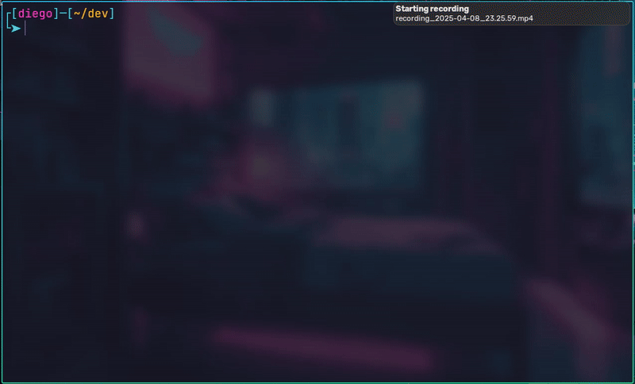

# kerneldiego.zsh-theme

A minimal and informative Zsh theme with a clean box-style layout, Git integration, and colorful prompt indicators for productivity and visual clarity.

## 🌄 Preview




## ✨ Features

- Box-style prompt layout using Unicode line characters.
- Shows current username and working directory.
- Git branch and short SHA display.
- Git diff summary (added, modified, deleted, renamed, unmerged, untracked).
- Custom symbols with color-coded segments.
- Lightweight and fast — no external dependencies.

## 🧩 Git Diff Symbols

>These are displayed dynamically in the second prompt line when inside a Git repository.

- +A —> Added files (green)
- ~M —> Modified files (yellow)
- -D —> Deleted files (red)
- R —> Renamed files (blue)
- U —> Unmerged files (magenta)
- ? —> Untracked files (cyan)

---

## 📦 Installation

### Using Oh My Zsh

1. Copy [kerneldiego.zsh-theme](https://raw.githubusercontent.com/KernelDiego/kerneldiego-zsh-theme/main/kerneldiego.zsh-theme) into `~/.oh-my-zsh/themes`.

2. Change `ZSH_THEME="kerneldiego"` in `~/.zshrc`.

3. Reload Zsh for apply theme to command:

   ```bash
   source ~/.zshrc
   ```

---

### Windows Installation

1. Download kerneldiego.zsh-theme

   ```shel
   wget -O ~/.oh-my-zsh/themes/kerneldiego.zsh-theme https://raw.githubusercontent.com/KernelDiego/kerneldiego-zsh-theme/main/kerneldiego.zsh-theme
   ```

2. Place it anywhere and source it in your .zshrc:

   ```shell
   sed -i 's/ZSH_THEME="kerneldiego"/ZSH_THEME="kerneldiego"/' .zshrc
   ```

3. Reload Zsh for apply theme to command:

   ```shell
   source ~/.zshrc
   ```

---

## 🔤 Font Recommendation

To properly render the prompt symbols, use a [Nerd Font](https://www.nerdfonts.com/), e.g., FiraCode Nerd Font or Hack Nerd Font, etc.

---

## Colors used

> To make your terminal look exactly like the screenshots, you can manually configure your terminal emulator with the HEX color values provided below. These colors are used in the theme's prompt styling, so setting them in your terminal ensures full visual consistency.

| Color   | HEX       | Preview |
|---------|-----------|---------|
| <span style="color:#FF2EC8">Magenta</span> | <span style="background-color:#FF2EC8; color:#000; padding:2px 6px; border-radius:4px;">#FF2EC8</span> | <div style="text-align:center;"><span style="display:inline-block; width:20px; height:20px; background-color:#FF2EC8; border:1px solid #ccc; border-radius:4px;"></span></div> |
| <span style="color:#00F0FF">Cyan</span>    | <span style="background-color:#00F0FF; color:#000; padding:2px 6px; border-radius:4px;">#00F0FF</span> | <div style="text-align:center;"><span style="display:inline-block; width:20px; height:20px; background-color:#00F0FF; border:1px solid #ccc; border-radius:4px;"></span></div> |
| <span style="color:#339CFF">Blue</span>    | <span style="background-color:#339CFF; color:#000; padding:2px 6px; border-radius:4px;">#339CFF</span> | <div style="text-align:center;"><span style="display:inline-block; width:20px; height:20px; background-color:#339CFF; border:1px solid #ccc; border-radius:4px;"></span></div> |
| <span style="color:#FF4B4B">Red</span>     | <span style="background-color:#FF4B4B; color:#000; padding:2px 6px; border-radius:4px;">#FF4B4B</span> | <div style="text-align:center;"><span style="display:inline-block; width:20px; height:20px; background-color:#FF4B4B; border:1px solid #ccc; border-radius:4px;"></span></div> |
| <span style="color:#3EFFA8">Green</span>   | <span style="background-color:#3EFFA8; color:#000; padding:2px 6px; border-radius:4px;">#3EFFA8</span> | <div style="text-align:center;"><span style="display:inline-block; width:20px; height:20px; background-color:#3EFFA8; border:1px solid #ccc; border-radius:4px;"></span></div> |
| <span style="color:#FFB700">Yellow</span>  | <span style="background-color:#FFB700; color:#000; padding:2px 6px; border-radius:4px;">#FFB700</span> | <div style="text-align:center;"><span style="display:inline-block; width:20px; height:20px; background-color:#FFB700; border:1px solid #ccc; border-radius:4px;"></span></div> |

---

## 🙏 Credits 

Made with ❤️ by [KernelDiego](https://github.com/KernelDiego/)
