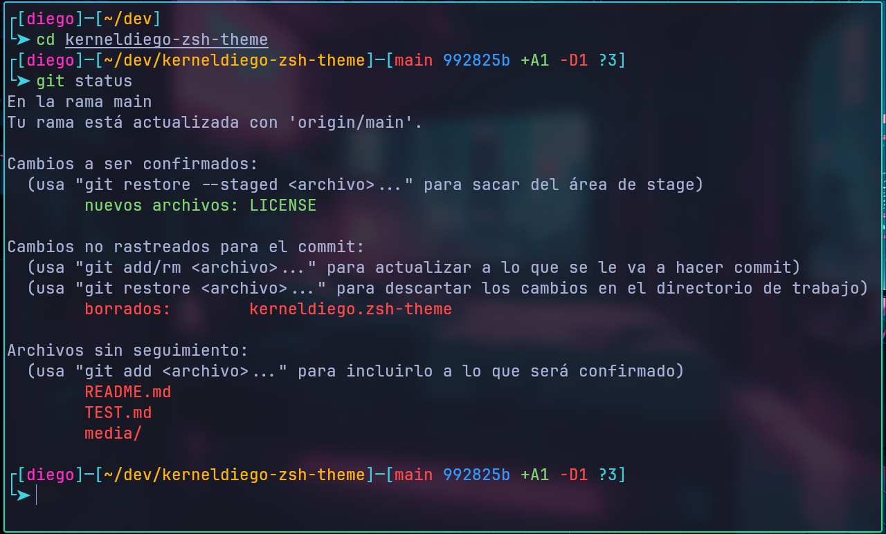

# kerneldiego.zsh-theme

A minimal and informative Zsh theme with a clean box-style layout, Git integration, and colorful prompt indicators for productivity and visual clarity.

## 🌄 Preview



## ✨ Features

- Box-style prompt layout using Unicode line characters.
- Shows current username and working directory.
- Git branch and short SHA display.
- Git diff summary (added, modified, deleted, renamed, unmerged, untracked).
- Custom symbols with color-coded segments.
- Lightweight and fast — no external dependencies.

## 🧩 Git Diff Symbols

>These are displayed dynamically in the second prompt line when inside a Git repository.

- +A —> Added files (green)
- ~M —> Modified files (yellow)
- -D —> Deleted files (red)
- R —> Renamed files (blue)
- U —> Unmerged files (magenta)
- ? —> Untracked files (cyan)

---

## 📦 Installation

### Using Oh My Zsh

1. Copy [kerneldiego.zsh-theme](https://raw.githubusercontent.com/KernelDiego/kerneldiego-zsh-theme/main/kerneldiego.zsh-theme) into `~/.oh-my-zsh/themes`.

2. Change `ZSH_THEME="kerneldiego"` in `~/.zshrc`.

3. Reload Zsh for apply theme to command:

   ```bash
   source ~/.zshrc
   ```

---

### Windows Installation

1. Download kerneldiego.zsh-theme

   ```shel
   wget -O ~/.oh-my-zsh/themes/kerneldiego.zsh-theme https://raw.githubusercontent.com/KernelDiego/kerneldiego-zsh-theme/main/kerneldiego.zsh-theme
   ```

2. Place it anywhere and source it in your .zshrc:

   ```shell
   sed -i 's/ZSH_THEME="kerneldiego"/ZSH_THEME="kerneldiego"/' .zshrc
   ```

3. Reload Zsh for apply theme to command:

   ```shell
   source ~/.zshrc
   ```
